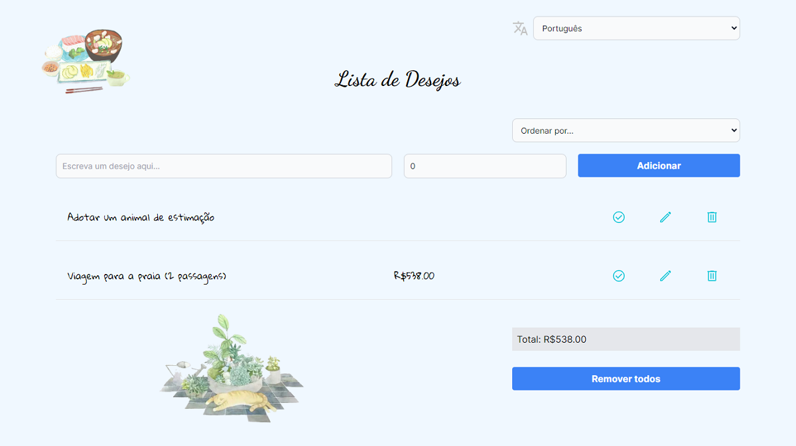

# Wishlist

- [English](README.md)
- [Portuguese](README.pt.md)
- [Spanish](README.es.md)

This is a [Next.js](https://nextjs.org/) project created with [`create-next-app`](https://github.com/vercel/next.js/tree/canary/packages/create-next-app).

It aims to list goods or services that a person wants.

The total of wished products appears at the bottom of the page.

The list can be sorted by product/service name, price and by id.

The fields can be translated into English, Portuguese and Spanish.
